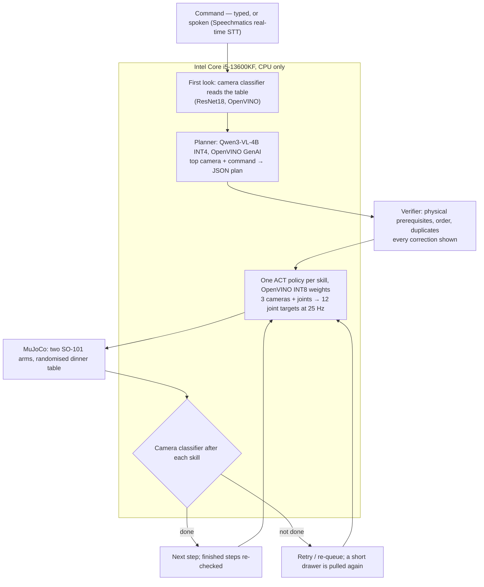

# Ten Places

Two simulated SO-101 arms set a dinner table in MuJoCo from a spoken or typed command: open the drawer, hand the
spoon and the fork from one arm to the other, place the plate, set the cup. A vision-language model plans, one learned
ACT policy per skill drives both arms from the cameras, a camera classifier checks every step. Everything runs on an
Intel CPU with OpenVINO.

- **92 of 100 held-out tables set completely** — two sets of 50 randomised tables, the shipped configuration, each run once.
- Grasps are friction contact only (~17 N gripper). No weld or attach constraint.
- At run time: cameras and joint angles only. No simulator object poses.
- The learned policies drive the arms: about 9 in 10 control steps; the rest is the return to the home pose between
  skills (joint interpolation). Inverse kinematics only generates training demonstrations; it moves nothing at run
  time (`docs/findings.md`).
- Hardware: an Intel Core i5-13600KF desktop CPU (no Core Ultra available); every OpenVINO optimisation below is
  measured on it.
- Hierarchical VLA — small learned policies under a larger VLM: the VLM reads the command and the top camera and
  plans; one ACT policy per skill (ACT is one of the challenge's named candidate policies) drives both arms from three
  cameras at 25 Hz. The plan selects and
  sequences the skills — a single skill-conditioned ACT learned to ignore its skill input (`docs/findings.md`), hence
  the split by skill.
- Every model that runs on the machine runs on OpenVINO: policies (INT8 weights), planner (Qwen3-VL-4B INT4,
  OpenVINO GenAI), classifier. Speech: Speechmatics' cloud service.

Intel online challenge *Bimanual VLA Manipulation with Multi-Modal Reasoning*, AI Infra Summit Hackathon 2026.

Seeds: held-out evaluation 0–49 and 200–249, never used for training; two early choices made on seeds 0–29 were
re-checked on tuning seeds and held (`docs/findings.md`). Tuning 100–199 and 300–399; demonstrations 1000+. Every number below names the script or result file it comes from.

## How it works



The same pipeline, as text:

```
"Set the table, but skip the cup."          (typed, or spoken → Speechmatics real-time STT)
        │   first look: the camera classifier reads the table; steps already done are not planned again
        ▼
Qwen3-VL-4B INT4 on OpenVINO GenAI  ── top-camera image + command → JSON plan (schema-constrained)
        │
        ▼
Verifier  ── adds physical prerequisites (cutlery needs the drawer open; the plate starts on the
             fork's spot), drops duplicates, fixes the order; every correction is shown
        │
        ▼
One ACT policy per skill (3 cameras + joints → 12 joint targets at 25 Hz), OpenVINO INT8 weights
        │   between skills: grippers released, arms home; after each: camera classifier (ResNet18, OpenVINO, 5–6 ms)
        │   → done / retry / re-queue the unfinished steps; finished steps are re-checked before the next one
        │   a drawer not open enough for the cutlery is pulled again; the pull ends when the camera sees it open
        ▼
MuJoCo: two SO-101 arms, randomised dinner table
```

VLM above small policies — a latency split:
- Policy: 16 ms per forward pass on the CPU (OpenVINO INT8 weights), so it runs every 40 ms control step and blends
  overlapping action chunks (temporal ensembling) — closed loop through contact.
- Tuning tables: spoon hand-off 43/50 with ensembling, 44/50 executing whole 50-action chunks, 4/50 re-planning every
  10 actions; drawer 20/20 with ensembling against 18/20 and 15/20 (seeds 100–119).
- End-to-end VLAs predict open-loop chunks. π0.5 (Intel's reference): 294 ms per inference, stock PyTorch, Core Ultra
  X7 358H at 40 W ([Intel](https://docs.openedgeplatform.intel.com/2026.1/OEP-articles/publications/optimizing-pi0.5-lva-model.html)).
  SmolVLA (450M) on this i5: 6.6 s per 50-action chunk, stock PyTorch, against 40 ms (PyTorch) and 16 ms (OpenVINO)
  for the ACT policy (`scripts/bench_smolvla.py`, `out/benchmark/smolvla.md`; timing only, public base checkpoint).
- Planner at conversation speed (seconds), policies at contact speed (25 Hz).

Talking while it works: "stop" halts at once (matched locally, no model call); "skip the fork", "and the cup too"
change the plan after the current step, verified like any plan. Replies by Speechmatics text-to-speech.

## Results

**Seeds 0–49** — 50 held-out randomised tables, every selection frozen beforehand, each run once
(`out/eval/final9/`, `out/eval/agent_table/ov_w8_report9.json`):

| Run | Full tables (95% CI) | Mean steps of 5 | Drawer | Spoon | Plate | Fork | Cup |
|---|---|---|---|---|---|---|---|
| **Full agent, OpenVINO** (re-checks, retries, re-queues failed steps) | **47/50 (84–98%)** | 4.90 | 50 | 48 | 50 | 49 | 48 |
| Fixed five-step sequence (drawer, plate, fork, cup retried once), OpenVINO INT8 weights | 44/50 (76–94%) | 4.86 | 50 | 47 | 49 | 49 | 48 |
| Fixed five-step sequence, PyTorch reference (CUDA GPU) | 47/50 (84–98%) | 4.94 | 50 | 49 | 49 | 50 | 49 |

- Success does not depend on inference speed (the simulation waits for each action): GPU and CPU rows differ only in
  the numbers the networks compute. OpenVINO INT8 vs PyTorch per seed: +1 / −4, McNemar p = 0.38.
- Configuration chosen on tuning seeds (fixed sequence with retries, seeds 100–199: 81/100 with the fork fine-tuned
  on its own stuck hand-offs, 76/100 before; `docs/findings.md`).

**Seeds 200–249** — a second held-out set, same frozen configuration, each run once; robustness rows on the same
tables (`out/eval/agent_table/ov_w8_fresh200-249_v9.json`, `ov_w8_fresh_*_v9.json`, `out/eval/v9_*/`):

| Run | Full tables (95% CI) |
|---|---|
| **Full agent, OpenVINO** | **45/50 (79–96%)** |
| Full agent; friction, masses, light, colours widened ×2.0 beyond the training ranges | 38/50 (63–86%) |
| Full agent; plate and cup sizes ±20%, cutlery length ±10% | 28/50 (42–69%) |
| Fixed five-step sequence, OpenVINO | 44/50 (76–94%) |
| Fixed sequence; friction, masses, light, colours widened ×1.5 beyond the training ranges | 42/50 (71–92%) |
| … widened ×2.0 | 36/50 (58–83%) |
| Fixed sequence; plate and cup sizes ±10%, cutlery length ±10% | 32/50 (50–76%) |
| Fixed sequence; plate and cup sizes ±20%, cutlery length ±10% | 30/50 (46–72%) |
| Fixed sequence; cup size only ±20% | 38/50 (63–86%) |

- Both held-out sets, full agent: 92/100. The last change — the fork fine-tuned on its own stuck hand-offs — paired
  against the run before it on the same tables: full agent 81 → 92 (+11 / −0, p = 0.001); fixed sequence 86 → 88
  (+9 / −7); the fork placed on 243 of 250 held-out runs at trained sizes, 235 before. Frozen runs of the five shipped
  configurations set 86, 82, 81, 81 and 92 of 100 (`docs/findings.md`); identical systems differ on 10–16 tables per
  100, so every comparison here is paired.
- Agent vs fixed sequence, same tables: 0–49 +4 / −1, 200–249 +3 / −2. Fixed sequence with vs without the drawer
  re-pull (an earlier run, same tables): 40/50 vs 30/50 (+11 / −1, p = 0.006).
- Robustness vs the same run at the training ranges and sizes, same tables. Fixed sequence (44/50): ×1.5 +5 / −7
  (p = 0.77), ×2.0 +5 / −13 (p = 0.10); sizes ±10% +2 / −14 (p = 0.004), ±20% +2 / −16 (p = 0.001), cup size only
  +2 / −8 (p = 0.11). Full agent (45/50): ×2.0 +4 / −11 (p = 0.12), sizes ±20% +1 / −18 (p < 0.001). Widened ranges:
  ×1.5 no loss, ×2.0 7–8 tables (not significant). Object sizes: a clear loss — plate, fork and cup each placed
  36–38/50 at ±20% against 47–50/50 at trained sizes.
- Sizes: the cup was trained on ×0.77–1.25 sizes; plate and cutlery on one size each. Two further size fine-tunes
  (plate ×0.8–1.2, more cup sizes) lost the trained size and were not shipped (`docs/findings.md`). The grader is
  size-proof (an object set on its target passes on all 50 tables at ±20%).
- Video: the first 10 seeds as a grid, pass/fail per seed. The first look (on in `run_agent.py`) is off in these rows;
  on fresh tables it skips nothing (`docs/findings.md`).

**Placement accuracy**, full agent, 100 held-out tables (simulator measurement): median error spoon 0.36 cm, plate
0.39 cm, cup 0.29 cm, fork 0.44 cm; every placed object within 1.5 cm of its target (largest 1.49 cm; tolerance
2.5 cm). Spoon and fork, each handed from arm to arm, placed on 191 of 200.

| Component | Result | Evidence |
|---|---|---|
| Demonstration runs: 10 tables, 10 requests fixed before recording (2 spoken, 1 changed mid-run by a scripted sentence), full agent on OpenVINO | 9/10 done exactly as asked; seed 4's plate missed four times, each miss caught by the camera | `scripts/score_demo.py`, `out/video/demo/summary.md` |
| Planner: unseen commands → correct verified plan | 8/8 on the set written before it was scored, incl. naming what no skill can do ("dim the lights"); 10/10, 5/5 and 4/6 on the three sets used while writing the prompts | `scripts/eval_planner.py` |
| First look: steps already done are skipped | fresh tables: none read as done (50/50); half-set tables: read exactly (50/50); agent on 50 fresh tables: skipped nothing | `scripts/eval_initial_state.py`, `eval_agent_table.py --look-first` |
| VLA baseline: SmolVLA (450M) fine-tuned on the same 100 cup demonstrations, 30 tuning tables, all seven starts | 63/210 cups placed (ACT, same data: 167/210; ACT cup with context demonstrations: 198/210); 6.6 s per chunk on this CPU against 16 ms | `scripts/train_smolvla.py`, `out/eval/context/cup_smolvla005000_*` |
| Mid-run spoken changes understood | 8/10 on sentences written before the run | `scripts/eval_amend.py --set fresh` |
| Camera classifier on learned-policy states | false "drawer done" 3/363, false "spoon done" 1/671 | `docs/findings.md` |
| Scripted demonstrator (training data) | 60/60 full tables, 72/72 verified subset plans | `make spike-table` |

Every change from 0 to 43 of 50 tables, what it measured, what did not work: [`docs/findings.md`](docs/findings.md).

## OpenVINO on an Intel Core i5-13600KF

**Policy latency** — the deployed skill policies, idle machine, batch 1 (`scripts/benchmark.py`,
`out/benchmark/<skill>_<step>.md`; the cup row measured on the previous cup checkpoint, same architecture):

| Variant | Latency median (p95) | Throughput | IR size |
|---|---|---|---|
| PyTorch FP32 eager (CPU, default 14 threads) | 39–45 ms (45–48) | – | – |
| OpenVINO FP32 (drawer, cup) | 18.4–19.5 ms (21–22) | 85–92 inf/s | 130.5 MB |
| **OpenVINO INT8 weights** (deployed) | **15.5–15.8 ms** (17–20) | 109–112 inf/s | 33.0 MB |
| … E-cores only | 37–66 ms | – | – |

**Control and planner at the same time** — policy with temporal ensembling + camera check at 25 Hz (40 ms budget)
while the 4B planner generates, 60 s per placement (`scripts/bench_concurrency.py`, `out/benchmark/concurrency.md`):

| Placement | Control step p50 / p99 | Steps over 40 ms | Planner answer (median) |
|---|---|---|---|
| Control alone, default scheduling | 24 / 36 ms | 0.1% | – |
| Control + planner, default scheduling | 53 / 70 ms | 97% | 4.2 s |
| P-cores for control, E-cores for the planner | 30 / 54 ms | 11% | 5.5 s |
| … + hyper-threading on for control | **29 / 36 ms** | **0%** | 5.5 s |
| … + pinned threads (`--cores split`, `tenplaces/cores.py`) | 29 / 55 ms | 6% | 5.9 s |

Default scheduling: the planner makes almost every control step late. Core split: fixed, planner 4.2 → 5.5 s.
Shipped: the pinned split (6% late). Hyper-threading on measured 0% in this run; not shipped.

**Power and energy** — CPU package power, HWiNFO64 (package, not wall), cup policy, 60 s per phase
(`scripts/power_bench.py`, `out/benchmark/power.md`):

| Phase | Package power | Inferences/s | Energy per inference, above idle |
|---|---|---|---|
| Idle | 18.0 W | – | – |
| PyTorch FP32, back to back | 108.9 W | 26 | 3.50 J |
| OpenVINO FP32, back to back | 109.3 W | 53 | 1.73 J |
| **OpenVINO INT8 weights, back to back** | 106.6 W | 62 | **1.43 J** |
| OpenVINO INT8 weights at 25 Hz, default scheduling | 63.3 W | 25 | 1.81 J |
| … at 25 Hz, P-cores, pinned | 56.0 W | 25 | 1.52 J |

Optimisation results:
- **Precision by task success, not output error.** INT8 weights keep full-table success (40 vs 41 of 50 for
  PyTorch, +3 / −4, p = 1.0). INT8
  activations in the transformer lose it (hand-off checkpoint: 7/20 against 13/20 FP32, 14/20 INT8 weights; same
  seeds). INT4 weights (23 MB instead of 33): four skills hold, the cup of that time drifts ~0.05 rad and fails every table (0/50
  against 41/50, tuning seeds); no faster than INT8 on this CPU in the same run (16.8–21.3 against 16.8–19.3 ms,
  `out/benchmark/opt_out_0914/`). Ladder stops at INT8 weights.
- **Latency spent on quality.** 16 ms per step allows temporal ensembling every step: drawer 20/20 against 18/20
  open-loop, 15/20 re-planning every 10 actions (seeds 100–119); spoon hand-off 43/50 against 4/50 re-planning every
  10 actions (open-loop whole chunks 44/50, seeds 100–149).
- **Hybrid cores.** Control on the P-cores, VLM on the E-cores: 25 Hz held while the planner runs. The first plan
  comes while the arms are still, so it runs on every core: median 7.1 s against 14.3 s on the E-cores, same plans
  (10 demo commands, `scripts/bench_planner_placement.py`). OpenVINO GenAI metrics for that plan: 3.45 s to the first
  token (image encoding + prefill, 452 tokens), then 8.4 tokens/s for 34 tokens
  (`out/benchmark/opt_out_0914/planner_placement.md`). Everything asked while the arms move (impossible-part check,
  spoken changes) stays on the E-cores.
- **Energy.** INT8 weights: 2.4× less energy per inference than PyTorch at its default 14 threads (1.43 vs 3.50 J
  above idle). At 25 Hz, P-core placement draws 7 W less than default scheduling.
- **Windows power throttling.** A process started from a console without a visible window can be classed as
  background (EcoQoS): 14-thread PyTorch matmul 227 GFLOP/s as launched, 646 GFLOP/s after opting out. The robot and
  the benchmarks opt out at start (`tenplaces.cores.no_power_throttling`).
- **Devices.** The benchmark and evaluation scripts take `--device`; `benchmark.py` lists the OpenVINO devices. The
  hybrid-core placement is CPU-only; Core Ultra iGPU/NPU paths untested (no Core Ultra available).
- **Intel Physical AI terms.** Hierarchical VLA: VLM as the reasoning layer, ACT as the action expert — the policy
  family Physical AI Studio exports to OpenVINO. Export here: `ov.convert_model` + NNCF (`tenplaces/ov_backend.py`);
  Physical AI Studio targets Linux, this machine runs Windows.
- **Model cache, measured.** OpenVINO `CACHE_DIR`: each skill policy ready in 0.16–0.17 s instead of 0.83–0.86 s
  (5×); the 4B planner loads slower from its 3 GB cache (8.8 s) than it compiles from its IR (4.7 s). Not used yet:
  policies would save ~3.4 s per launch, the planner would lose ~4 s (`scripts/bench_compile_cache.py`,
  `out/benchmark/compile_cache.md`).

## The scene

`mujoco.MjSpec`, from the official SO-101 model (Apache-2.0); every prop a MuJoCo primitive.
- Arm A (x = −0.30 m) faces arm B (x = +0.30 m). **Hand-offs forced by reach:** fingers down, neither arm grasps past
  the table's midline; cutlery from A's drawer that ends on B's side changes hands.
- Drawer: a tray under a fixed lid; cutlery reachable only once arm A has pulled it open.
- Finger collision meshes replaced by box pads (the stock meshes fill the gap between the jaws); gripper force
  limited to ~17 N.
- Randomised per seed, uniformly (`tenplaces/scene_table.py`, `sample()`; positions in the table frame; object sizes
  fixed unless `TENPLACES_SHAPE` is set, as in the robustness rows):

  | What | Range |
  |---|---|
  | Drawer (closed tray centre) | x −15 to 0 mm, y 70 to 100 mm |
  | Spoon and fork in the tray | ±5 mm across; along: spoon 0 to 4 mm, fork 32 to 36 mm |
  | Plate start | x 150 to 190 mm, y 70 to 100 mm |
  | Cup start | x 190 to 205 mm, y −150 to −135 mm |
  | Placemat (the plate's target) | x 110 to 125 mm, y −15 to 15 mm |
  | Friction, every contact | 0.7 to 1.3 |
  | Mass: cutlery / plate / cup | 25–60 g / 80–160 g / 40–90 g |
  | Light | direction tilted up to ±0.5 in x and y from straight down; diffuse 0.4 to 0.9 |
  | Colours | table RGB 0.2–0.8 per channel, floor 0.1–0.5 |

## Training

- Demonstrations: a scripted controller with privileged state (IK for the 5-DOF arm, closed-loop drawer pull). Never
  used at run time.
- One LeRobot ACT policy per skill, fine-tuned on demonstrations from every start a verified plan can produce, on
  layouts weighted toward the hard cases, and on takeover episodes (learned policy starts, scripted controller
  finishes). The cup also on sizes ×0.77–1.25.
- Takeovers from the policies' own failures, found by running each policy alone first: the plate from the moment its
  grasp slips (the rim wall under one pad); the fork from wherever its hand-off stopped — B holding it, A holding it
  short of the exchange point — with the scripted controller continuing, not restarting (`docs/findings.md`).
- Camera classifier: scripted runs labelled by the simulator, incl. drawer pulls that stop short, so "drawer done"
  means open far enough for the cutlery.

## Run it

```
make third-party      # the official SO-101 model (TheRobotStudio/SO-ARM100) at the pinned commit
pip install -r requirements-lock.txt
make models HF_SKILLS_REPO=<user>/<repo>   # trained skills + classifier, and the OpenVINO planner (~4.4 GB)
make test             # 192 tests
make watch SEED=3                                        # scripted controller, live 3D viewer
make watch-agent CMD="just the plate and the cup" SEED=3 # VLM plan + learned policies, live
make agent CMD="set the table, but skip the cup" SEED=3  # rendered to out/video/ with the plan panel
make bench                                               # OpenVINO benchmark of the five deployed policies
make report                                              # held-out seeds 0-49 (hours; PyTorch row needs CUDA)
make report-fresh                                        # held-out seeds 200-249 and the robustness rows
make grid                                                # score the 10 demo runs, tile them into one video
```

`requirements-lock.txt`: the exact environment of every number (Python 3.13, openvino 2026.3.1, openvino-genai
2026.3.1, nncf 3.3.0, mujoco 3.13.0, lerobot 0.6.1; torch for training only).

Voice (`SPEECHMATICS_API_KEY`):

```
python scripts/run_agent.py --mic --listen --speak --seed 3 --video out/video/voice_s3.mp4
```

- Spoken command → arms start when the transcript is final.
- `--listen`: microphone stays open. "stop" halts at once (local match, no model call); anything else goes to the
  planner, is verified, and takes over when the current step ends — no object dropped mid-air.
- `--speak`: the robot says its plan, the reason for any correction ("I'll open the drawer first — the spoon is
  inside"), and what it cannot do.
- Speech on worker threads; the control loop never waits for the network. Hybrid-core placement on by default
  (`--cores default` turns it off).

## Limitations

- 8 of 100 held-out tables not set completely. First failed step: spoon 4, cup 2, plate 1, drawer 1
  (`docs/findings.md`).
- Object sizes: plate and cutlery trained on one size each, the cup on ×0.77–1.25. Sizes ±20% cost tables: fixed
  sequence 30/50 vs 44/50, full agent 28/50 vs 45/50 (p ≤ 0.001). The size-trained cup improved the cup alone at ±20%
  on untouched tuning tables (80 → 99 of 150); two further size fine-tunes lost the trained size (the rim grasps have
  millimetres of margin) and were not shipped.
- First look: a table half-set out of the trained order (plate out before the spoon) can make a later skill fail; the
  verifier flags such orders.
- Plate knocked off its mat: noticed 27/75, put back 2/75. Experimental classifier + plate fine-tune: 77/80 noticed,
  30/80 put back — below the 60/80 set before the attempt; not shipped (`docs/findings.md`).
- Learned rollouts repeat only up to rendering (a new OpenGL context can shift a few pixels by one intensity level):
  two runs of the fixed sequence disagree on ~16 of 100 tables. Results: 50 seeds per row, Wilson intervals, paired
  McNemar tests.
- Measured on a desktop Intel CPU without iGPU or NPU; Core Ultra (`--device GPU` / `NPU`) untested.

## Layout

```
tenplaces/scene.py, scene_table.py   procedural MJCF: arms, pads, table, props, cameras
tenplaces/ik.py, control.py          fingers-down IK for the 5-DOF SO-101; two-arm motion (demonstrator only)
tenplaces/oracle/                    scripted privileged-state controllers (demonstrations only)
tenplaces/env.py, env_table.py       25 Hz episode environments, demo recording, hand-over between skills
tenplaces/planner.py                 VLM planner (OpenVINO GenAI) + symbolic verifier
tenplaces/state_classifier.py        camera-only task-state classifier (OpenVINO)
tenplaces/agent.py                   command → plan → per-skill policy → check → retry / re-queue
tenplaces/voice.py, listen.py, speak.py   Speechmatics speech-to-text, live listening, text-to-speech
tenplaces/evaluate*.py, grader*.py   closed-loop evaluation and success predicates
tenplaces/lerobot_policy.py, skill_policies.py, ov_backend.py   policies and their OpenVINO backends
tenplaces/cores.py                   hybrid-core placement for control and planner
tenplaces/demo_video.py              demo renderer with the live plan panel
```

| Challenge deliverable | Where |
|---|---|
| Reproducible repository | this repo, `Makefile` |
| MuJoCo simulation with randomisation and evaluation config | `tenplaces/scene_table.py` (`sample()`), `scripts/final_report.py` |
| Intel inference benchmark | `scripts/benchmark.py`, `scripts/bench_concurrency.py` |
| Video across 10 randomised seeds | `scripts/final_report.py --videos 10` + `scripts/make_grid_video.py` |
| Technical README / architecture | this file, `docs/findings.md` |
| — architecture | [How it works](#how-it-works), [Layout](#layout) |
| — VLA / VLM model choice | [How it works](#how-it-works) (latency split, SmolVLA baseline), [Results](#results) |
| — bimanual coordination strategy | [The scene](#the-scene) (hand-offs forced by reach), `docs/findings.md` (fork hand-off) |
| — training approach | [Training](#training) |
| — robustness methods | [Results](#results) (randomisation, widened ranges, sizes), [Limitations](#limitations) |
| — OpenVINO optimisation | [OpenVINO on an Intel Core i5-13600KF](#openvino-on-an-intel-core-i5-13600kf) |
| — Intel hardware mapping | same section (P-/E-core placement, precision per model) |

## Licence

MIT. SO-ARM100 assets: Apache-2.0 (TheRobotStudio). Qwen3-VL-4B: Apache-2.0.
